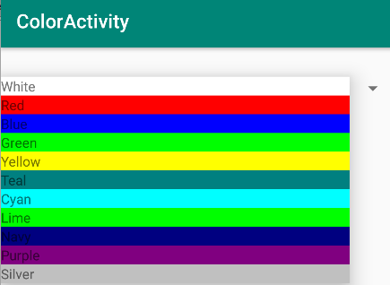
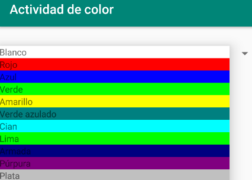

# SpanishColorActivity
Maguire Qvale Introduction to Mobile Application Development section 003 Assignment 5 App. 
A spinner that the user can use to pick the background color. Using Fragments, when the spinner is in drop down mode the choices match the color. When an item is selected, the another fragments is crated with the background set to the chosen color. The spinner can be in Enlgish or Spanish usng Locale. 

